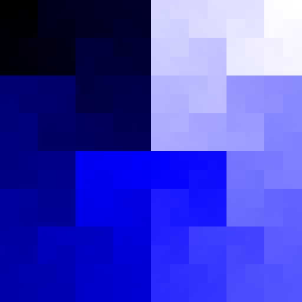

# hilbert16

Hilbert transforms between 1D and 2D space, optimized for u16 coordinates.

[](https://github.com/ryanavella/hilbert16/blob/master/LICENSE-MIT) [](https://github.com/ryanavella/hilbert16/blob/master/UNLICENSE) [](https://crates.io/crates/hilbert16) [](https://docs.rs/hilbert16)



# Examples

```rust
use hilbert16::{Curve, Point};

let order = 9;
let curve = Curve::new(order).unwrap();
            
let p = Point { x: 175, y: 295 };
println!("{:?} => {}", p, curve.dist_at(p).unwrap();
let d = 94_085;
println!("{} => {:?}", d, curve.point_at(d).unwrap();
```
